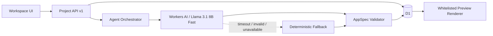
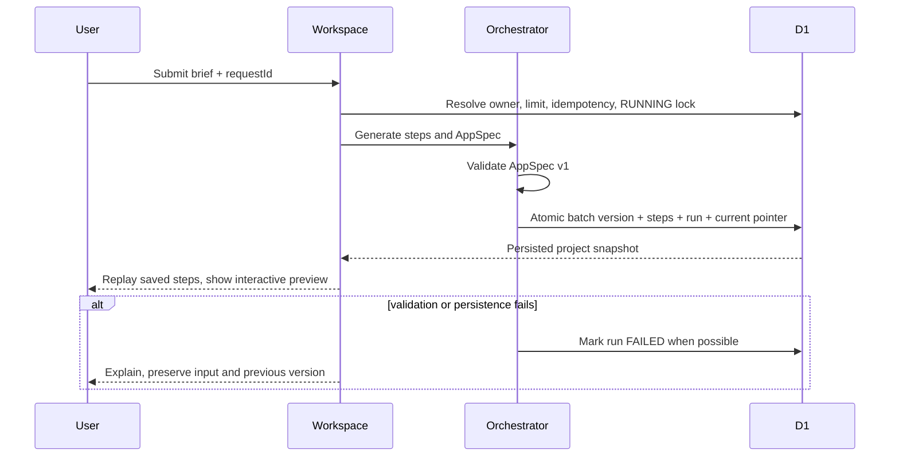

# Atoms AI App Builder Demo 技术方案

> 状态：`DRAFT`。本文件定义可直接实现的 v1 契约；详细正向/异常闭环见 `verification-matrix.md`。

## 1. 当前事实与目标设计

| 主题 | 当前事实与证据 | 本期设计 | 不改动项 |
| --- | --- | --- | --- |
| 应用 | 只有 Sites Starter | 单页三栏生成工作区 | 不引入第二个前端工程 |
| 生成 | 已发布版本仅有确定性规则生成器 | Cloudflare Workers AI 生成 AppSpec v1 与四角色真实阶段产出；确定性规则仅作为不可用/超时/非法输出的降级 | 不执行模型生成的 HTML/JavaScript，不引入第三方 API Key |
| 数据 | 已有空 D1 示例 | D1 保存 project/message/run/step/version/limit | 不使用浏览器存储作为事实源 |

## 2. 组件边界与事实源



### 2.1 模型生成契约（DESIGN-004）

- 生产模型固定为 Cloudflare Workers AI `@cf/meta/llama-3.1-8b-instruct-fast`，通过 Worker `AI` binding 调用；不保存外部 API Key。该选择来自 GLM 在四个线上 Worker version 的 25/25/25/55 秒超时证据，以及 Cloudflare 官方对 Fast 版本和 JSON Mode 支持的声明；切模不扩大现有等待预算。
- 一次调用输出严格 envelope `{ spec, summary, steps }`，顶层和子对象均拒绝额外字段。`summary` 为去控制字符后的 1..160 字符；`steps` 长度必须为 4，按顺序且不重复地包含 `product`、`architecture`、`design`、`engineering`，每项只允许 `{ role, summary }`，摘要为 1..180 字符；服务端补固定角色显示名与 `COMPLETED` 状态，不允许模型控制身份或状态。不得再使用固定摘要冒充模型产出。
- 服务端只接受 AppSpec v1 白名单 JSON。模型输出先验证完整 envelope，再执行与规则生成相同的 `validateAppSpec`；未知/额外字段、错误类型、悬空引用、越界数组、非法枚举、超长摘要或错误角色顺序均不进入 D1 version。
- 请求设置 `max_tokens=2200`、`response_format={type:"json_object"}` 和 55 秒模型调用超时；为 envelope 校验、D1 completion batch/回查与网络响应预留 10 秒，完整 API E2E 预算为 65 秒。提取后的文本响应 UTF-8 最大 48 KiB。binding 缺失、平台错误、超时、空响应、响应过大、JSON 解析失败或 envelope/AppSpec 校验失败时，只记录枚举失败码并尝试确定性生成；若确定性生成也不支持该修改，则返回既有 422 且不移动当前版本。日志不记录 prompt、模型原文或异常堆栈中的外部响应。
- UI 在请求期间持续显示 BUILDING、保留 composer 输入并禁用提交。页面刷新或并发重放读到 BUILDING 项目时，不新建 requestId、不再调用生成 API，而是每 1.5 秒读取同一 project。READY 后停止轮询并根据成功 event 展示 `workers_ai/SUCCESS` 或 `deterministic/FALLBACK/<failureCode>`；FAILED 后停止轮询，展示 run/request error_code 与重试入口，不得伪造 generation 来源，因为模型与 fallback 都失败时没有成功 event/version/assistant message。轮询读取失败保留画面并允许下次轮询恢复；组件卸载必须清理 timer。
- 每次成功写入的 run 必须在 `generation_events(run_id, source, model, outcome, failure_code, duration_ms, created_at)` 留下唯一来源审计。event 与 project/run/version/messages/steps/current pointer 位于同一 D1 batch；event 插入失败则整批失败，不能出现已发布 version 无来源或来源成功但 version 不存在。`source` 仅为 `workers_ai` 或 `deterministic`；前端展示最近一次生成来源，线上验收必须证明至少一次 `workers_ai/SUCCESS`，不能用降级结果冒充模型已接通。
- 初版继续生成把当前 AppSpec 连同用户修改请求传给模型；模型必须返回完整新 AppSpec，版本仍遵守 parent/base/current 的既有乐观并发契约。
- 模型名称和参数集中配置，后续升级只替换适配层并重新验收，不改变 AppSpec/Renderer/D1 项目契约。

模型调用采用两阶段受控协议。阶段一先做 requestId 幂等查询，再做 owner/global 限流、项目容量、owner/base/current 和同项目 RUNNING 检查；任何拒绝都发生在 AI 调用前。通过后生成不可猜测的 `attempt_token`，以一个 D1 batch 预占：首次创建写 workspace_request、BUILDING project、RUNNING run（含 token）、PENDING steps 和 user message；继续生成写 RUNNING run（含 token）、PENDING steps、user message 并把既有 project 标为 BUILDING。唯一索引保证相同项目只有一个 RUNNING，workspace ledger 保证相同 owner+requestId 只有一个预占成功；冲突方回读既有状态且 AI 调用次数为 0。

阶段二仅由持有 `(run_id, attempt_token, status=RUNNING)` 的请求调用一次模型并完成。完成 batch 先以 run token 和 base/current 守卫插入 version，再只在目标 version 存在时完成 steps、run、project/current、workspace_request（首次）和 generation_event；generation_event 使用 `INSERT ... SELECT` 且同时要求目标 run 为 COMPLETED、目标 version 存在、project current pointer 已指向目标 version。batch 后回查 version、run、event 与 current pointer；任一不一致不得报告成功。

模型与确定性降级均失败、completion batch 抛错或 completion 回查不一致时，都必须立即执行 token-guarded failure batch：只在原 run 仍为 RUNNING 且 token 匹配时把 run/request/steps 标为 FAILED、写枚举 error_code、清空 attempt_token，并将 project 恢复为上一成功版本的 READY，首次无版本项目标为 FAILED。D1 completion batch 内的 version/event/current/run-complete 更新按事务语义整体回滚；阶段一已经提交的 user message 保留为失败尝试的审计输入，不新增 assistant 成功消息，后续 UI 可显示失败并允许用新 requestId 重试。failure batch 后回查最终状态；若 failure batch 自身失败则返回 500 且依赖读取超时回收，不得报告成功。

读取路径用一个 D1 batch 回收超过 2 分钟的 RUNNING：run 更新为 `FAILED/RUN_TIMEOUT` 并清空 `attempt_token`，关联 request 和 PENDING steps 标为 FAILED；project 有 current version 时从 BUILDING 恢复为 READY，无 current version 时改为 FAILED，同时更新 updated_at。回收 batch 后回查 project/run/request/steps，禁止项目永久停留 BUILDING。调用中断后相同 requestId 重放返回该 ledger 的 FAILED 状态而不二次调用模型，用户明确重新生成时使用新 requestId。55 秒模型超时后先使本次 runner 进入降级；任何迟到模型结果因 attempt token/run 状态守卫不能插入 version 或 event。`PROJECT_BUSY`、`RATE_LIMITED`、项目容量拒绝、重复 RUNNING requestId 均必须在调用前返回，AI 调用次数为 0。

## 3. AppSpec v1 与真实交互契约（DESIGN-002）

AppSpec 是不可执行的 JSON，不包含 HTML、CSS、JavaScript 或 URL 脚本。服务端生成后必须校验，客户端只渲染白名单字段。

```ts
type AppSpecV1 = {
  schemaVersion: 1;
  kind: "dashboard" | "tracker" | "landing";
  title: string;                 // 1..60
  subtitle: string;              // 0..140
  theme: { accent: "violet" | "coral" | "mint" | "blue"; density: "comfortable" | "compact" };
  stats: Array<{ id: string; label: string; value: string; delta?: string }>; // 0..4
  filters: Array<{ id: string; label: string; options: string[]; defaultValue: string; allValue?: string }>; // 0..2, options 1..6; allValue 必须属于 options
  cards: Array<{ id: string; title: string; description: string; tag: string; filterValues?: Record<string, string>; done?: boolean }>; // 1..12; key 必须是 filter id
  form?: { id: string; title: string; fields: Array<{ id: string; label: string; placeholder: string; required: boolean }>; submitLabel: string }; // fields 1..4
  actions: Array<
    | { id: string; label: string; kind: "set_filter"; targetId: string; value: string }
    | { id: string; label: string; kind: "toggle_item"; targetId: string }
    | { id: string; label: string; kind: "add_item"; targetId: string }
    | { id: string; label: string; kind: "show_toast"; message: string }
  >; // 1..8
};
```

运行时局部状态仅包含 `selectedFilters`、`toggledCardIds`、`draftFields`、`addedCards` 和 `toast`。`set_filter.targetId` 必须命中 filter id 且 `value` 必须属于其 options；当选中值等于该 filter 的 `allValue` 时跳过此维度过滤，否则 card 通过 `filterValues[filterId]` 精确匹配，缺少该 key 的 card 在该筛选下始终可见。没有 `allValue` 时所有 option 都按普通值精确匹配。`toggle_item.targetId` 必须命中 card id。`add_item.targetId` 必须命中 form id；提交时使用第一个 field 作为新 card 标题，其余非空字段按声明顺序拼接为 description，tag 固定为“新建”，然后清空 draft。筛选必须改变可见卡片；toggle 必须改变完成态；表单校验后必须增加一张可见卡片。局部预览状态不作为产品数据事实源，刷新后恢复版本的初始状态。

未知 `schemaVersion`、未知字段值、重复 ID、悬空 action target 或超出大小限制均由服务端返回 `APP_SPEC_INVALID`，不得写入 version。客户端遇到未知可选字段时忽略；遇到未知版本时展示只读错误卡并保留最后成功版本。

示例 A（dashboard，筛选交互）：

```json
{"schemaVersion":1,"kind":"dashboard","title":"Roamly 旅行计划","subtitle":"把下一次出发安排得井井有条","theme":{"accent":"violet","density":"comfortable"},"stats":[{"id":"s1","label":"已计划行程","value":"6","delta":"+2 本月"}],"filters":[{"id":"status","label":"状态","options":["全部","筹备中","已完成"],"defaultValue":"全部","allValue":"全部"}],"cards":[{"id":"c1","title":"京都周末","description":"3 天城市漫游","tag":"筹备中","filterValues":{"status":"筹备中"}},{"id":"c2","title":"海边假期","description":"已归档照片与清单","tag":"已完成","filterValues":{"status":"已完成"}}],"actions":[{"id":"a1","label":"查看筹备中","kind":"set_filter","targetId":"status","value":"筹备中"}]}
```

示例 B（tracker，表单与完成态交互）：

```json
{"schemaVersion":1,"kind":"tracker","title":"Launchpad 发布清单","subtitle":"今天完成最重要的一步","theme":{"accent":"mint","density":"compact"},"stats":[{"id":"s1","label":"完成率","value":"67%"}],"filters":[],"cards":[{"id":"c1","title":"确认首屏文案","description":"Owner: Emma","tag":"内容","done":false}],"form":{"id":"task-form","title":"添加任务","fields":[{"id":"task","label":"任务名称","placeholder":"例如：邀请 5 位测试用户","required":true}],"submitLabel":"加入清单"},"actions":[{"id":"a1","label":"完成任务","kind":"toggle_item","targetId":"c1"},{"id":"a2","label":"添加任务","kind":"add_item","targetId":"task-form"}]}
```

## 4. API v1、状态机与恢复协议（DESIGN-001）

统一响应为 `{ data, error: null }` 或 `{ data: null, error: { code, message } }`。所有项目端点先解析服务端 owner，再按 owner 查询；不存在和不属于当前 owner 都返回 404，避免泄露存在性。

| Method / Route | 请求 | 成功 | 主要错误 |
| --- | --- | --- | --- |
| `GET /api/workspace` | 无 | 项目摘要列表、当前项目完整快照 | 500 |
| `POST /api/projects` | `{ prompt, requestId }` | 新项目 + 完成 run + version | 400/409 cap/422/429/500 |
| `GET /api/projects/:id` | 无 | project/messages/runs/steps/versions | 404/500 |
| `POST /api/projects/:id/generate` | `{ prompt, requestId, baseVersionId }` | 新 run + version | 404/409 busy-or-stale/422/429/500 |
| `POST /api/projects/:id/versions/:versionId/activate` | `{ expectedCurrentVersionId }` | 更新后的 project snapshot | 404/409 stale/500 |

`requestId` 为客户端每次明确提交生成的 UUID。首次建项目先写 `workspace_requests(owner_key, request_id, project_id, run_id, status)`，`(owner_key, request_id)` 唯一；projectId/runId 由服务端在写请求行前生成。该行、project 和 RUNNING run 在同一 D1 batch 创建。相同 owner + requestId 重试：COMPLETED 返回已有快照，RUNNING 返回 202 与当前 snapshot，FAILED 返回已保存错误；绝不新建第二个 project。已有项目继续生成仍由 `runs(project_id, request_id)` 唯一去重。

Run 状态：`RUNNING -> COMPLETED | FAILED`；Step 状态：`PENDING -> RUNNING -> COMPLETED | FAILED`。固定四步为 `product`、`architecture`、`design`、`engineering`。服务端等待一次真实模型生成（或明确降级）并持久化全部 step；客户端收到快照后用 350ms 间隔依次揭示已保存 step，明确这是可读执行回放，不伪装为模型流式输出。

创建 run 时依赖 `UNIQUE(project_id) WHERE status='RUNNING'`，同项目并发请求返回 `PROJECT_BUSY`。生成完成使用一次 D1 `batch` 顺序执行带守卫的语句：

1. `INSERT INTO versions ... SELECT ... WHERE EXISTS(run status='RUNNING') AND ((baseVersionId IS NULL AND project.current_version_id IS NULL) OR project.current_version_id=baseVersionId)`；首次版本显式传 `baseVersionId: null`，禁止空字符串代替；
2. 仅在目标 version 已存在时完成 steps；
3. 仅在目标 version 已存在且 run 仍为 RUNNING 时完成 run；
4. 仅在目标 version 存在、run 已 COMPLETED 且 current pointer 仍与 base 做同样 null-safe 匹配时更新 project；
5. 若该 run 来自 `POST /api/projects`，仅在 version 与 current pointer 均已命中时把对应 `workspace_requests.status` 更新为 COMPLETED；失败处理同步写 FAILED 与错误码。

因此超时回收或并发激活先改变状态后，迟到 batch 不会插入 version 或移动指针。batch 后必须回查 version 与 current pointer；任一未命中返回 `STALE_RUN`，不得把“语句成功但影响 0 行”报告为成功。`version_no` 在持有 RUNNING 锁时取 `MAX + 1`，并由 `(project_id, version_no)` 唯一约束兜底。

请求在最终 batch 前中断可能遗留 RUNNING。任何 workspace/project 读取都会用一个 D1 batch 把 `updated_at` 超过 2 分钟的 RUNNING run 标记为 FAILED/`RUN_TIMEOUT` 并清空 attempt token、把关联 `workspace_requests`（如有）标记为 FAILED/`RUN_TIMEOUT`、把尚未完成的 step 标记为 FAILED，并把 project 按是否已有 current version 从 BUILDING 恢复为 READY 或 FAILED，从而释放锁并保留上一成功版本。相同首次 requestId 重试返回该已保存超时错误；用户点击“重新生成”必须创建新的 requestId。读取失败时 UI 保留当前画面并提供重试，不清空输入或缓存快照。

## 5. 数据模型、所有权与原子性（DESIGN-003）

- `projects(id, owner_key, title, prompt, status, current_version_id, created_at, updated_at)`；索引 `(owner_key, updated_at)`。
- `workspace_requests(owner_key, request_id, project_id, run_id, status, error_code, created_at, updated_at)`；主键 `(owner_key, request_id)`，用于首次建项目跨重试幂等与返回已保存失败。
- `messages(id, project_id, role, content, created_at)`；索引 `(project_id, created_at)`。
- `runs(id, project_id, request_id, base_version_id, attempt_token, status, error_code, created_at, updated_at)`；唯一 `(project_id, request_id)` 与 partial unique RUNNING；attempt token 仅用于服务端完成守卫，不返回客户端或日志。
- `run_steps(id, run_id, ordinal, role, status, summary, created_at, updated_at)`；唯一 `(run_id, ordinal)`。
- `versions(id, project_id, parent_version_id, version_no, app_spec_json, change_summary, created_at)`；唯一 `(project_id, version_no)`；创建后永不更新。
- `rate_limits(bucket_key, window_start, action, count)`；主键 `(bucket_key, window_start, action)`；`bucket_key` 为 owner_key 或固定 `global`，`action` 为 `generate` 或 `create_project`。
- `generation_events(run_id, source, model, outcome, failure_code, duration_ms, created_at)`；主键 `run_id` 且外键语义一对一关联 run，只记录模型来源、结果和耗时，不保存 prompt 或模型原始响应。表创建必须兼容已有首版 D1；旧 run 允许没有 event，CHG-003 部署后的新 run 不允许缺失。

版本激活使用 `UPDATE projects SET current_version_id=? WHERE id=? AND owner_key=? AND current_version_id=? AND NOT EXISTS (SELECT 1 FROM runs WHERE project_id=? AND status='RUNNING')`；影响行数不是 1 则返回 `STALE_VERSION` 或 `PROJECT_BUSY`，不改变状态。修改必须携带 `baseVersionId` 且等于当前版本；新版本记录 `parent_version_id`。历史 AppSpec 永不覆写。

## 6. 修改意图契约（FR-006）

规则生成器支持以下修改组合：主题色（紫/珊瑚/薄荷/蓝）、密度（紧凑/舒适）、增加统计卡、增加表单、调整标题/副标题、把看板切换为 tracker。支持中文和常见英文关键词。未命中任何支持意图返回 422 `UNSUPPORTED_CHANGE`，附可选示例；不创建 version、不改变 current pointer。

过期 `baseVersionId`、不存在版本和并发修改返回 409/404，并保持所有版本与当前指针不变。用户可先激活历史版本，再基于该当前版本发起修改。

## 7. 匿名身份、安全与容量（DEC-006/009）

- Cookie 名称 `atoms_workspace`，值为 128-bit 随机 token（base64url），`httpOnly`、`SameSite=Lax`、Path `/`、Max-Age 30 天；生产启用 `Secure`，localhost 关闭 `Secure`。不轮换有效 token；Cookie 丢失视为新工作区。
- 若存在 `oai-authenticated-user-id`，owner 原文为 `user:<id>`；否则为 `anon:<cookieToken>`。`owner_key = SHA-256(owner 原文 + 固定域分隔符)`。数据库与日志只使用 owner_key 前 12 位作为诊断标识，绝不记录 Cookie、prompt 全文或身份邮箱。
- 所有写入由服务端绑定 owner；拒绝客户端 owner 字段。SQL 全部参数绑定。prompt 去除 NUL/控制字符、trim 后必须 1..800 字。
- 每个 owner 每个自然分钟最多 6 次生成，同时全站每分钟最多 120 次生成、30 次新建项目。D1 对 owner bucket 与固定 `global` bucket 使用 `(bucket_key, window_start, action)` UPSERT 原子加一，任一超限返回 429 和 `retryAfterSeconds`；跨 Worker 实例共享。读请求不计数。
- 每 owner 最多 20 个项目，全站最多 5000 个项目。创建 batch 先更新 owner/global create bucket，然后用 `INSERT INTO projects ... SELECT ... WHERE owner_count < 20 AND global_count < 5000` 条件插入；后续 workspace_request 与 run 也只在该 project 已存在时插入。batch 后回查 project，不存在则返回 409 `PROJECT_LIMIT_REACHED` 或 503 `SITE_CAPACITY_REACHED`，不留下悬空 request/run，也不自动删除或淘汰数据。workspace_request 唯一键兜底重复创建。
- 匿名 Cookie 可由访问者主动清除，因此 owner 级额度不是强身份防滥用；全局分钟桶与全站项目上限是实际容量兜底。恶意者仍可能消耗共享额度造成临时拒绝服务，此限制记录在 VibeTest `gaps.md`，公开 Demo 不宣称企业级防滥用。
- AppSpec 白名单渲染，不执行用户 HTML、脚本或外链。错误响应不回显内部 SQL、堆栈或 owner_key。

## 8. 主链路与失败链路



## 9. 可观测、部署与回滚

API 日志只记录 requestId、route、status、duration、projectId 和脱敏 owner 标签。记录 `APP_SPEC_INVALID`、`PROJECT_BUSY`、`STALE_VERSION`、`RATE_LIMITED` 计数。schema 迁移只新增表、索引和版本记录，可重复执行；应用回滚不删除 D1 数据。线上冒烟失败时回滚上一部署。

## 10. 外部前提与开放项

引用 `open-questions.md` Q-002，以及 `.vibetest/atoms-demo/gaps.md`。UI 明确标注“可解释的 Agent 工作流”，不宣称调用未接入的外部大模型。
