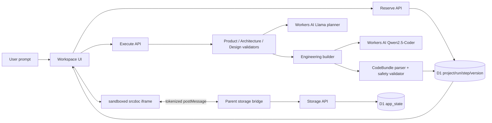
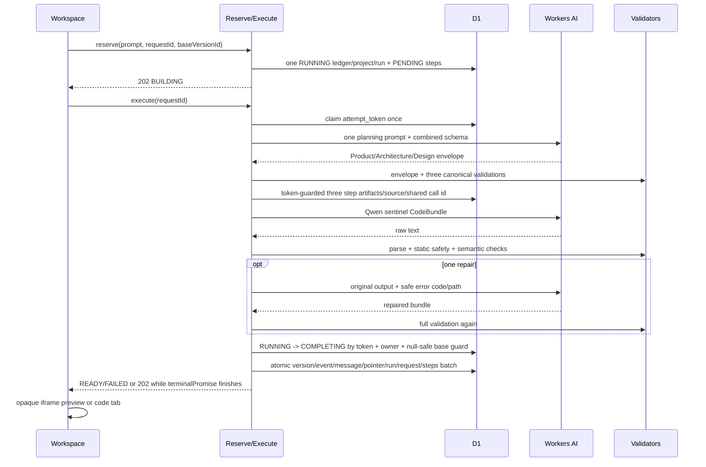

# CHG-010 Code Sandbox Generation 技术方案

> 状态：`CONFIRMED_FOR_DESIGN_FREEZE`。独立复核：`codex-independent-chg010-design-reviewer-r4`；冻结不表示实现或线上模型已通过。

## 1. 当前事实与目标设计

| DESIGN | 当前事实与证据 | 本期设计 | 明确不改动 |
| --- | --- | --- | --- |
| DESIGN-101 工作台 | 已有 idea-first 三栏工作台、四阶段状态、刷新轮询（EV-004） | 保留主流程，模板改为计数器/Todo/计算器；右侧增加“预览/代码” | owner Cookie、项目列表、设备切换 |
| DESIGN-102 生成物 | AppSpec 只有 3 类页面与 4 类 action，无法表达计数器（EV-003/004） | 新生成物为严格 `CodeBundle v1`：HTML body fragment + CSS + JS | 旧 AppSpec JSON 不改写 |
| DESIGN-103 Agent 编排 | 现有四阶段均调用 Llama，任一失败可能进入无关模板 | 单次 Llama 规划调用同时返回 Product/Architecture/Design 三个可独立校验 artifact；Engineering 单次调用 Qwen2.5-Coder，必要时一次 Qwen repair；规划失败可用需求相关的确定性计划继续，但最终代码必须来自 Qwen 或计数器专用编译器 | reserve/execute 两段幂等、52/62/65 秒总预算 |
| DESIGN-104 沙箱 | 当前 React renderer 只执行白名单 action | CodeBundle 在 `sandbox="allow-scripts"` 的 opaque-origin `srcdoc` 中运行，CSP 与静态校验双层拒绝外联/导航/危险 API | 生成代码绝不在 Worker `eval` |
| DESIGN-105 应用状态 | 当前预览状态仅在 React 内存，刷新丢失 | 注入 `Atoms.storage`，通过受控 `postMessage` 到父页面，再由服务端 owner/project 授权写 D1 | D1 仍是持久化事实源 |
| DESIGN-106 版本兼容 | versions 保存不可变 `app_spec_json`，已有历史数据（EV-004/012） | 新增 `artifact_kind`；旧行默认 `app_spec`；新行存 `code_bundle`；旧项目修改产生新 CodeBundle 子版本 | 不覆盖历史 JSON，不删除项目/消息/版本 |
| DESIGN-107 失败与审计 | 64% fallback，粗粒度失败码不能定位具体字段（EV-003） | 无关通用模板删除；保存公开错误码、阶段、字段路径、模型、耗时、token、bundle bytes、validator codes，不保存 raw prompt/response/code | 上一成功版本与 current pointer 失败时不变 |
| DESIGN-108 发布 | 已有 Cloudflare AI/D1 binding 与公网 Worker | 加性 D1 migration；最终部署必须有 Qwen 真实成功、在线交互、D1 状态和 10 条语义基准证据 | 不把本地 fake runner 当线上成功 |
| DESIGN-109 截止与证据 | 现有分阶段协议已有线上 artifact 证据 | 使用单一 monotonic `t0` 固定 52/62/65 秒截止、稳定证据字段和语义基准 | 不用客户端计时替代服务端事实 |
| DESIGN-110 运行事务 | 现有 `RUNNING` 唯一索引与 guarded D1 batch | 全部 active 状态共享唯一索引；null-safe base guard；completion/failure 单胜者 | 不削弱 requestId 幂等与迟到 token 守卫 |
| DESIGN-111 计数器编译器 | 已有固定无关 template 不能满足计数器 | 仅在严格计数器意图且 Qwen 失败时生成需求对齐的受控 CodeBundle，最终记为 `deterministic/SUCCESS` | 不处理其它应用类型，不冒充模型成功 |

## 2. 组件边界与事实源



事实源只有两类：项目/版本/run/审计与生成应用状态均以 D1 为准；浏览器只持有当前渲染实例、输入草稿和随机 channel token。模型输出、iframe 消息、client owner/project 字段均是不可信输入。

## 3. CodeBundle v1 与模型协议

### 3.1 持久化对象

```ts
type CodeBundleV1 = {
  schemaVersion: 1;
  kind: "code_bundle";
  title: string;          // 1..60 Unicode characters
  summary: string;        // 1..180
  entry: "index.html";
  files: {
    "index.html": string; // HTML body fragment, 1..12 KiB
    "styles.css": string; // plain CSS, 1..12 KiB
    "app.js": string;     // plain browser JS, 1..16 KiB
  };
  capabilities: {
    storage: boolean;
  };
};
```

- UTF-8 三文件总计不超过 32 KiB；模型 raw response 不超过 48 KiB。
- object 必须 exact-key，禁止额外文件、路径、空文件、控制字符、NUL、重复 sentinel。
- `index.html` 是 body fragment，禁止 `html/head/script/style/link/meta/base/iframe/object/embed`，禁止 `on*` inline handler，禁止非 `#` 的 `href/src/action`。
- CSS 禁止 `@import`、`url(`、`expression(`、`behavior:`、`-moz-binding` 与大小写不敏感的 `</style` raw-text 终止序列。
- JS 禁止静态/动态 import、export、eval/new Function、fetch/XHR/WebSocket/EventSource/sendBeacon、Worker/ServiceWorker、Cookie、parent/top/opener、直接 postMessage、location/open 导航、大小写不敏感的 `</script` raw-text 终止序列、`while`/`do while`/传统 `for(;;)` 与 `requestAnimationFrame`。数组方法和有限 `setTimeout/setInterval` 允许；运行时再限制同时存在的 timer 不超过 25、最小 delay 16ms。
- 静态拒绝不是完整 JavaScript 安全证明；它与 opaque-origin iframe、sandbox、CSP、消息/存储限额共同组成 Demo 风险边界。蓄意构造的所有 CPU/内存攻击仍是 `ACCEPTED_RISK`，不对外宣称完全隔离。

### 3.2 Engineering 输出格式

Qwen 不使用未获官方支持的 JSON Mode。它必须返回且只返回以下有序文本协议：

```text
<<<ATOM_META>>>
{"schemaVersion":1,"kind":"code_bundle","title":"...","summary":"...","entry":"index.html","capabilities":{"storage":true}}
<<<ATOM_FILE:index.html>>>
...
<<<ATOM_FILE:styles.css>>>
...
<<<ATOM_FILE:app.js>>>
...
<<<ATOM_END>>>
```

parser 的冻结 grammar 如下：

1. 输入必须是 UTF-8；只允许把 CRLF 规范化为 LF，孤立 CR、NUL、U+2028/U+2029 一律拒绝。raw UTF-8 大小必须 `<= 48 KiB`。
2. 五种 marker 必须各出现一次，按示例顺序出现并独占整行；首 marker 前、终 marker 后只允许空格、Tab 与 LF。任何文件正文或 JSON 字符串中再次出现 `<<<ATOM_` 都拒绝。
3. meta marker 与首个 file marker 之间去掉首尾空白后必须恰好是一个 JSON object；exact-key schema 与 `CodeBundleV1` 的公共字段一致，不允许 `files` 或额外字段。
4. 每个 file body 是相邻两个 marker 之间的原始 LF 文本；只去掉 marker 后必然存在的一个 LF，不做 trim、实体解码或 Unicode 规范化。三个 body 均必须非空并按字节上限复核。
5. `capabilities.storage=true` 当且仅当 `app.js` 至少包含一次允许的 `Atoms.storage.get/set/delete/list/clear` 调用；为 false 时三文件不得出现 `Atoms` 或 `Atoms.storage`；HTML/CSS 永远不得出现该命名空间。

第一次 `INVALID_CODE_BUNDLE` 可在剩余模型预算内调用一次 Qwen repair；repair 输入只含原输出、公开 validator code/path 和已验证上游 artifact，不写 D1。第二次失败结束；只有明确计数器意图可进入 DESIGN-111 的专用编译器。parser 与 validator 必测 marker-in-string/body、`</script>`、`</style>`、NUL、U+2028/U+2029、CRLF、孤立 CR、恰好 48 KiB 与 48 KiB+1。

### 3.3 单次规划调用与三个 canonical artifact

Llama 只调用一次，使用 JSON object 兼容模式返回 exact envelope `{schemaVersion:1,product,architecture,design}`；envelope 禁止额外字段，三个子对象必须分别满足下述 schema。服务端按 Product → Architecture → Design 顺序 exact-key/type/length/unique 二次校验并更新三个 UI step；模型 schema 能力不作为安全边界。任一子对象无效则整个 planning envelope 无效，三步统一进入 deterministic planning，并在 error path 保留首个失败子对象路径。

Product：

```json
{"type":"object","additionalProperties":false,"required":["schemaVersion","summary","audience","goal","features","dataEntities","persistenceRequired"],"properties":{"schemaVersion":{"const":1},"summary":{"type":"string","minLength":1,"maxLength":180},"audience":{"type":"string","minLength":1,"maxLength":120},"goal":{"type":"string","minLength":1,"maxLength":180},"features":{"type":"array","minItems":1,"maxItems":8,"uniqueItems":true,"items":{"type":"string","minLength":1,"maxLength":120}},"dataEntities":{"type":"array","maxItems":6,"uniqueItems":true,"items":{"type":"string","minLength":1,"maxLength":80}},"persistenceRequired":{"type":"boolean"}}}
```

Architecture：

```json
{"type":"object","additionalProperties":false,"required":["schemaVersion","summary","components","interactions","stateModel","storageKeys","constraints"],"properties":{"schemaVersion":{"const":1},"summary":{"type":"string","minLength":1,"maxLength":180},"components":{"type":"array","minItems":1,"maxItems":10,"uniqueItems":true,"items":{"type":"string","minLength":1,"maxLength":80}},"interactions":{"type":"array","minItems":1,"maxItems":10,"uniqueItems":true,"items":{"type":"string","minLength":1,"maxLength":120}},"stateModel":{"type":"string","minLength":1,"maxLength":240},"storageKeys":{"type":"array","maxItems":10,"uniqueItems":true,"items":{"type":"string","pattern":"^[A-Za-z0-9._-]{1,64}$"}},"constraints":{"type":"array","maxItems":8,"uniqueItems":true,"items":{"type":"string","minLength":1,"maxLength":120}}}}
```

Design：

```json
{"type":"object","additionalProperties":false,"required":["schemaVersion","summary","visualDirection","layout","colorTokens","interactionStates","responsiveNotes","accessibilityNotes"],"properties":{"schemaVersion":{"const":1},"summary":{"type":"string","minLength":1,"maxLength":180},"visualDirection":{"type":"string","minLength":1,"maxLength":180},"layout":{"type":"string","minLength":1,"maxLength":120},"colorTokens":{"type":"object","additionalProperties":false,"required":["background","surface","text","accent","muted"],"properties":{"background":{"type":"string","pattern":"^#[0-9A-Fa-f]{6}$"},"surface":{"type":"string","pattern":"^#[0-9A-Fa-f]{6}$"},"text":{"type":"string","pattern":"^#[0-9A-Fa-f]{6}$"},"accent":{"type":"string","pattern":"^#[0-9A-Fa-f]{6}$"},"muted":{"type":"string","pattern":"^#[0-9A-Fa-f]{6}$"}}},"interactionStates":{"type":"array","minItems":1,"maxItems":10,"uniqueItems":true,"items":{"type":"string","minLength":1,"maxLength":100}},"responsiveNotes":{"type":"array","minItems":1,"maxItems":6,"uniqueItems":true,"items":{"type":"string","minLength":1,"maxLength":120}},"accessibilityNotes":{"type":"array","minItems":1,"maxItems":6,"uniqueItems":true,"items":{"type":"string","minLength":1,"maxLength":120}}}}
```

每个 planning artifact 最大 12 KiB，combined raw envelope 最大 32 KiB。下游只接收三个均已验证的对象。若单次 planning 调用失败或 envelope 任一子对象失败，服务端为三个子对象统一生成下述 bounded deterministic planning artifact（每个 step source=`deterministic`、保存同一原失败码/path）并继续 Qwen；UI 必须逐 step 展示真实 source，不能把替代计划标成模型成功。所有构造结果必须再通过与模型输出完全相同的 canonical parser；构造器自身不能绕过校验。

确定性构造只使用 `trimmedPrompt`（UTF-8 `<= 2000` 字符）和固定纯函数：

- 通用：`short120/short180` 按 Unicode code point 截断；空白折叠为单空格。`persistenceRequired` 仅在 `/刷新|保存|持久|记住|restore|persist|save/i` 命中时为 true。
- Product：`schemaVersion=1`，`summary="将需求转为可运行前端应用：" + short120`，`audience="应用的直接使用者"`，`goal=short180`，`features=[short120]`，`dataEntities=persistenceRequired ? ["app-state"] : []`，`persistenceRequired` 使用通用规则。
- intent 分支按优先级 `counter > todo > calculator > form > default`，每个分支仅由固定词表命中；未命中使用 default，不能臆造需求实体。
- Architecture：`schemaVersion=1`，`summary="纯前端沙箱架构：" + short120`；counter 组件/交互为 `["计数显示","增减与重置控件"]`/`["增加","减少","重置"]`，todo 为 `["任务列表","新增表单","状态筛选"]`/`["新增任务","切换完成","删除任务","筛选任务"]`，calculator 为 `["数字输入","运算控件","结果显示"]`/`["输入数字","选择运算","清空结果"]`，form 为 `["内容区","表单","成功提示"]`/`["填写表单","校验必填项","显示成功提示"]`，default 为 `["内容区","主要控件","状态提示"]`/`["操作主要控件","更新页面状态"]`。`stateModel` 固定为 persistenceRequired 时 `"内存状态与 Atoms.storage 持久状态"`，否则 `"页面内存状态"`；`storageKeys` 分支固定为 counter=`["counter.value"]`、todo=`["todo.items"]`、其它持久化=`["app.state"]`、非持久化=`[]`；constraints 恰为 `["纯前端","禁止外部网络","沙箱运行"]`。
- Design：`schemaVersion=1`，`summary="清晰、响应式的界面：" + short120`，`visualDirection="现代、简洁、强调主要操作"`；layout 按 intent 固定为 counter=`"居中卡片与水平操作区"`、todo=`"表单、筛选与纵向列表"`、calculator=`"数字面板与结果区"`、form=`"内容区与表单卡片"`、default=`"单栏响应式卡片"`；颜色固定为 `background=#F5F7FB,surface=#FFFFFF,text=#172033,accent=#635BFF,muted=#6B7280`；`interactionStates=["默认","悬停","聚焦","禁用","成功","错误"]`，`responsiveNotes=["窄屏改为单列","触控目标至少44像素"]`，`accessibilityNotes=["表单控件具有关联标签","状态变化可被辅助技术感知"]`。

### 3.4 模型与时间预算

| 阶段 | 模型 | response format | 单阶段上限 | max tokens |
| --- | --- | --- | --- | --- |
| Planning（一次返回 Product/Architecture/Design） | `@cf/meta/llama-3.3-70b-instruct-fp8-fast` | `json_object` + prompt 内 combined canonical schema | 12s | 1800 |
| Engineering | `@cf/qwen/qwen2.5-coder-32b-instruct` | plain text sentinel | 32s | 6000 |
| Repair | Qwen，同一上游 artifact | plain text sentinel | min(8s, remaining) | 6000 |

DESIGN-109 使用 execute route 入口注入的单一 monotonic clock：`t0=now()`、`modelDeadline=t0+52000ms`、`persistenceDeadline=t0+62000ms`、`responseDeadline=t0+65000ms`。wall clock 只用于审计时间戳，不参与截止判断。

- 每次 AI 调用 timeout 为 `min(stageLimit, modelDeadline-now())`；remaining `<=0` 不启动调用，repair remaining `<500ms` 不启动 repair。任何在 52s 后返回的模型结果都不能进入 `RUNNING -> COMPLETING` claim。
- execute claim 同时写入服务端绝对时间 `attempt_expires_at`（由 `t0` 对应 wall time +62s 派生，仅供跨请求租约判断）；所有 completion/failure claim 都要求 token 匹配且租约未过期。executor 在 `t0+60000ms` 设置 timeout watchdog：若尚无 terminalPromise，它直接启动唯一的 `timeoutFailureBatch`，该 D1 atomic batch 在同一批次内以 token/lease guard 把 `RUNNING -> FAILING -> FAILED` 并收敛 request/steps/project，不能先 claim 再另起 batch。若 run 已是 COMPLETING 或其它 executor 已建立 terminalPromise，watchdog changes=0 且不竞争。terminal D1 batch 必须在 62s 前开始；若 event-loop stall 令 watchdog 未运行，62s 后租约自动失效，任何迟到 executor 都无法取得 completion/failure claim，读取路径立即按 expired lease 收敛并返回公开 `PERSISTENCE_TIMEOUT`，不等待 120s。
- D1 atomic batch 一旦已开始不能安全取消；不得与第二个 completion/failure write 竞速。唯一 `terminalPromise` 必须自然完成并回读一次。若它在 62s 后完成，记录 `persistence_deadline_exceeded=true`；若 64.5s 后才可回读，记录 `response_budget_exceeded=true`。状态安全优先，禁止把已提交成功伪造成 FAILED；任一超界均使 VT/发布门禁失败。
- route 在入口取得 `vinext/shims/request-context` 的 `getRequestExecutionContext()` 并封装为可注入 `BackgroundTasks.waitUntil`；production 缺失该能力时在 reserve/AI 前返回 503，测试与本地 adapter 注入等价 scheduler。正常路径最晚在 `t0+64500ms` 开始最终 terminal snapshot 回读并立即序列化响应。若 64.5s 时 `terminalPromise` 仍 pending，route 把同一个 promise 登记到 `waitUntil`，立即返回 exact `202 {project:<ProjectSnapshot status="BUILDING">,run:{id,publicStatus:"FINALIZING"},retryAfterMs:500}`；内部 COMPLETING/FAILING 永不进入公共 schema。UI 继续轮询同一 run，不重启 AI。后台 promise 是唯一写入者，完成后轮询得到 READY/FAILED。这样 HTTP 最晚 65s 返回，又不会取消或伪造 D1 结果。
- `now()>=responseDeadline` 后不得再发起 AI 或新的 terminal batch；无 in-flight batch 且 lease 已过期时返回 `PERSISTENCE_TIMEOUT` 并由 expired-lease read recovery 收敛，有 in-flight terminalPromise 时只能返回上述 202。
- run 超过 120s 由读取路径回收；迟到 AI、旧 token、旧 status 都不能写 version/event/message/pointer。fake clock 固定覆盖 51,999/52,000、61,999/62,000、64,500/65,000ms，以及 AI/D1 在边界前启动、边界后返回的胜者协议。

## 4. 主链路与失败链路



失败收敛：

1. reserve 前完成 owner/global rate、项目容量、同项目 busy 与 base version 检查，拒绝时 AI 调用为 0。
2. `ACTIVE_RUN_STATUSES = ('RUNNING','COMPLETING','FAILING')` 是 reserve busy、unique index、activate、execute replay 和 stale/lease recovery 的唯一常量。execute 只有 `RUNNING + attempt_token + runner_claimed_at IS NULL` 能 claim；重放任一 active 状态只回读，COMPLETED 回读同一 snapshot，FAILED 返回同一错误。
3. planning 模型失败可记录 deterministic plan 后继续；Qwen/parse/repair 失败时，只有 DESIGN-111 严格匹配的计数器编译器可以产生 `deterministic/SUCCESS` 版本，另以 `fallback_reason=<真实 Qwen 失败码>` 透明记录触发原因；其余进入 failure batch。
4. completion 前执行一条 guarded claim：目标 run 必须匹配 `run_id + project_id + attempt_token + status='RUNNING' + attempt_expires_at>now`，并通过同一 SQL 的 project/owner 存在性与 `projects.current_version_id IS runs.base_version_id` null-safe guard，再改为 `COMPLETING`。SQLite `IS` 同时正确处理首版 `NULL IS NULL` 和已有版本相等。`changes=0` 时不得写任何 version/event/message/pointer，必须回读 terminal/busy/base-conflict 状态。
5. 只有取得 `COMPLETING` 独占权的 executor 能执行 completion D1 batch；batch 内每一条 insert/update 都使用同一个 guarded `EXISTS(run_id,token,status='COMPLETING',lease,owner,null-safe base)`，任何 guard 失败时全部语句 `changes=0`，回查拒绝成功；version、generation_event、assistant message、current pointer、run/request/steps 同成同败。completion batch 抛错会完整回滚，随后同 token 将 `RUNNING/COMPLETING -> FAILING -> FAILED`，清 token/expiry，PENDING/RUNNING step 失败，已有版本项目回 READY、首版项目回 FAILED；failure batch 的每条 mutation 同样 token/status guarded。保留 user message，禁止 assistant 成功 message。
6. failure batch 自身失败时，读取路径先按 `attempt_expires_at<=now` 立即回收；旧行没有 expiry 才使用 120s 兜底。回收覆盖 `RUNNING/COMPLETING/FAILING` 并收敛为同一终态。迟到 executor 因 token/status/lease 不匹配不得插 version/event/message 或移动 pointer。
7. 版本 activate 也必须使用 owner guard、base/current guard且 `NOT EXISTS` 同项目任一 `ACTIVE_RUN_STATUSES`；并发 reserve 与 activate 只有一个成功。

## 5. 接口与内部契约

| Contract | Provider/Consumer | 输入及可信来源 | 输出 | 错误 | 兼容 |
| --- | --- | --- | --- | --- | --- |
| CONTRACT-101 Reserve | `/api/projects`, `/generate` → UI | prompt/requestId/baseVersion；owner 只由 server header/cookie | 202 ProjectSnapshot BUILDING | 400/409/429/503 | 请求/响应字段向后兼容 |
| CONTRACT-102 Execute | `/execute` → UI | project path + requestId；server owner | 200 READY/FAILED snapshot；terminal D1 pending 时 exact 202 `{project: BUILDING snapshot,run:{id,publicStatus:"FINALIZING"},retryAfterMs}` | 409/500/503；内部 COMPLETING/FAILING 不外泄；幂等回读且 202 不重启 AI | 保留两段流程 |
| CONTRACT-103 Version union | store → UI | D1 `artifact_kind` + `app_spec_json` | `artifactKind` 与 `appSpec` 或 `codeBundle` 二选一 | INVALID_STORED_ARTIFACT | 缺 kind 一律 app_spec |
| CONTRACT-104 Storage RPC | iframe → parent | exact message、event.source、origin=`null`、channel token、requestId/op/key/value | exact success/error response | 5s BRIDGE_TIMEOUT | 仅 code_bundle 暴露 |
| CONTRACT-105 Storage API | `/api/projects/:id/storage` → parent | owner server 恢复；project path；body 不接受 owner | `{value}`/`{items}`/`{ok}` | 400/404/409/429 | 新接口，不影响旧项目 |
| CONTRACT-106 Audit | generator/store → D1/UI | server 计算的 model/source/duration/tokens/hash/bytes/codes | safe generation/steps | 无 raw output | 旧列为空时可读 |

`CONTRACT-104` 的 RPC 是封闭 discriminated union；每个分支只允许列出的 key，`requestId` 为 UUID，`channelToken` 为当前 mount 的 128-bit 随机 token：

```ts
type StorageRequest =
  | { type: "atoms:storage:request"; channelToken: string; requestId: string; op: "get"; key: string }
  | { type: "atoms:storage:request"; channelToken: string; requestId: string; op: "set"; key: string; value: JsonValue }
  | { type: "atoms:storage:request"; channelToken: string; requestId: string; op: "delete"; key: string }
  | { type: "atoms:storage:request"; channelToken: string; requestId: string; op: "list" }
  | { type: "atoms:storage:request"; channelToken: string; requestId: string; op: "clear" };

type StorageResponse =
  | { type: "atoms:storage:response"; channelToken: string; requestId: string; ok: true; data:
      | { op: "get"; value: JsonValue | null }
      | { op: "set"; stored: true }
      | { op: "delete"; deleted: boolean }
      | { op: "list"; items: Array<{ key: string; value: JsonValue }> }
      | { op: "clear"; cleared: number } }
  | { type: "atoms:storage:response"; channelToken: string; requestId: string; ok: false;
      error: { code: "INVALID_REQUEST" | "NOT_FOUND" | "INVALID_STATE_KEY" | "INVALID_STATE_VALUE" | "STATE_KEY_LIMIT" | "STATE_BYTES_LIMIT" | "RATE_LIMITED" | "PERSISTENCE_ERROR"; message: string } };
```

`CONTRACT-105` 固定为 `POST /api/projects/:projectId/storage`，JSON body 是去掉 `type/channelToken` 后的 exact `{requestId,op,key?,value?}` 联合；body、query、header 均不接受 owner/version。服务端从 Cookie/请求上下文恢复 owner。成功应用结果返回 200 与同形 `data`；schema 错误 400、未知/他人 project 统一 404、容量冲突 409、rate 429、存储异常 500；错误 body 固定 `{ok:false,error:{code,message}}`，不返回 D1/owner/token 细节。

`ProjectSnapshot.versions[]` 的联合契约：

```ts
type VersionSnapshot =
  | { artifactKind: "app_spec"; appSpec: AppSpec; codeBundle: null; /* common fields */ }
  | { artifactKind: "code_bundle"; appSpec: null; codeBundle: CodeBundleV1; /* common fields */ };
```

服务端对 D1 artifact 也执行版本/大小/shape 校验；未知 kind 或损坏 JSON 返回可读错误，不把内容送入 DOM。

## 6. D1 数据、状态与一致性

### 6.1 schema

- `versions.artifact_kind TEXT NOT NULL DEFAULT 'app_spec'`。现有 `app_spec_json` 作为兼容 JSON payload 列保留名称；新 code bundle 直接存完整 bundle JSON。
- `generation_events` 加 `artifact_kind TEXT`、`artifact_bytes INTEGER`、`validator_json TEXT`、`input_tokens INTEGER`、`output_tokens INTEGER`、`fallback_reason TEXT`。旧 event 允许 NULL；它继续与 terminal success/failure batch 原子写入，不承载事后才能知道的响应时延。
- 新增 `run_deadline_audit(run_id TEXT PRIMARY KEY, model_deadline_at INTEGER NOT NULL, persistence_deadline_at INTEGER NOT NULL, response_deadline_at INTEGER NOT NULL, model_deadline_exceeded INTEGER NOT NULL DEFAULT 0, persistence_deadline_exceeded INTEGER NOT NULL DEFAULT 0, response_budget_exceeded INTEGER NOT NULL DEFAULT 0, lease_expired INTEGER NOT NULL DEFAULT 0, observed_at INTEGER NOT NULL)`。terminal batch 原子插入初值；`terminalPromise.finally` 由同一 `waitUntil` 链执行幂等 audit-only UPDATE，按实际 settle/read 时间补齐 persistence/response 布尔值。该 UPDATE 不改变 project/run/version/event 业务状态；失败必须进入证据 GAP 并阻塞发布，不能反改已提交终态。
- `app_state(owner_key TEXT, project_id TEXT, state_key TEXT, value_json TEXT, value_bytes INTEGER, updated_at TEXT, PRIMARY KEY(owner_key, project_id, state_key))`，并建 `(project_id, updated_at)` index。
- `runs.status` 新增运行值 `COMPLETING/FAILING`，不改列类型；新增 `attempt_expires_at INTEGER NULL`，单位 epoch milliseconds，所有 SQL 使用 server 传入的同一 `nowEpochMs` 比较。stale recovery、busy 与 activate 检查覆盖三种非终态。
- 可重复 migration 建立权威 partial unique index `runs_project_active_idx ON runs(project_id) WHERE status IN ('RUNNING','COMPLETING','FAILING')`；旧 `runs_project_running_idx` 可保留兼容但不再作为正确性边界。迁移前若发现多条 active run，按 `created_at,id` 只保留最早一条 active，其余以 `MIGRATION_ACTIVE_RUN_CONFLICT` 收敛 FAILED；整个 repair + index 建立在事务内。并发 ensureSchema 以 migration ledger/transaction 串行，duplicate column/index race 后 PRAGMA 与 `sqlite_master` 强制回查。
- Drizzle 声明写入 `db/schema.ts`，运行初始化继续用 prepared SQL；`ensureColumns` 在 duplicate-column race 后强制 PRAGMA 回查。
- 新增 `storage_rate_events(id TEXT PRIMARY KEY, owner_key TEXT NOT NULL, created_at INTEGER NOT NULL)` 与 `(owner_key,created_at)`、`(created_at)` indexes。它是 storage write 60s 滑动窗口的原子 reservation ledger；过期行清理仅为维护，不参与正确性。

### 6.2 storage 边界

- key regex `^[A-Za-z0-9][A-Za-z0-9._-]{0,63}$`；`__atoms.` 为系统保留前缀，guest 请求明确禁止。guest 不得传 owner/project/version。
- value 只允许 JSON null/boolean/finite number/string/array/plain object；深度最多 8、节点最多 500、UTF-8 最多 8 KiB。
- 每项目最多 50 key、总 value bytes 最多 64 KiB。set 使用单条 guarded `INSERT ... SELECT ... FROM projects p WHERE p.id=? AND p.owner_key=? AND <替换后的 count<=50> AND <SUM(value_bytes)-old_bytes+new_bytes<=65536> ON CONFLICT(owner_key,project_id,state_key) DO UPDATE ...`；授权、key count 与 bytes 必须在同一语句，不能先查后写。`changes=0` 后按固定优先级回查：owner/project 404 → key count `STATE_KEY_LIMIT` → total bytes `STATE_BYTES_LIMIT` → `PERSISTENCE_ERROR`。
- get/list/delete/clear 均先 `SELECT 1 FROM projects WHERE id=? AND owner_key=?`；未知或他人项目统一 404。list 只返回 key/value，不返回 owner。
- write rate：owner 60/min、global 1000/min；生产常量不可由 HTTP 覆盖。set/delete/clear 在状态 mutation 前先执行一条原子 conditional insert：`INSERT INTO storage_rate_events(id,owner_key,created_at) SELECT ?,?,? WHERE (SELECT COUNT(*) FROM storage_rate_events WHERE owner_key=? AND created_at>=?)<60 AND (SELECT COUNT(*) FROM storage_rate_events WHERE created_at>=?)<1000`。`changes=0` 返回 429 且不执行 state mutation；成功 reservation 后才执行 mutation。并发测试必须覆盖同 owner 59/60/61、跨 owner global 999/1000/1001，且限流失败 state hash 不变。
- 状态按 project 共享，不按 version 分叉；切换历史版本不自动删除状态。

## 7. iframe、CSP 与消息桥安全

父页面为每次 mount 生成 128-bit channel token，并将其与当前 `projectId/versionId` 绑定在闭包，不写 D1/localStorage/URL。`srcdoc` 由受信 wrapper 生成：

```text
default-src 'none'; script-src 'unsafe-inline'; style-src 'unsafe-inline';
img-src data:; connect-src 'none'; font-src 'none'; media-src 'none';
object-src 'none'; frame-src 'none'; worker-src 'none';
base-uri 'none'; form-action 'none'
```

- iframe 唯一 sandbox token 为 `allow-scripts`；不加 same-origin/forms/popups/downloads/top-navigation。
- generated CSS/HTML/JS 绝不直接拼进 `<style>`、`<script>` 或 wrapper raw-text。服务端/父页面分别把三个已验证 UTF-8 文件编码为标准 base64；base64 字母表是进入 trusted `srcdoc` 字符串 literal 的唯一 generated bytes。冻结 bootstrap 先解码 CSS 并赋给新建 `style.textContent`，再把 HTML fragment 赋给 `document.body.innerHTML`，最后把 JS 赋给新建 `script.textContent` 并 append；bridge/error reporter 在 generated JS 前完成冻结。这样合法正文中的 `</script>`/`</style>` 也不能终止 wrapper，但 validator 仍把它们作为负向用例拒绝，保持最小攻击面。
- 先注入冻结的 `window.Atoms.storage` 与 error/unhandledrejection reporter，再按上述 base64 bootstrap 注入 validated CSS/HTML/JS。bootstrap 本身固定 SHA-256 并纳入 build/test 证据。
- parent 收消息必须同时满足：`event.source === iframe.contentWindow`、`event.origin === "null"`、channel token 常量时序比较、exact message schema、requestId UUID、允许 op、key/value 限制。任一失败静默丢弃并计本地安全计数，不发 API。
- guest 接收响应也检查 `event.source === parent`、channel token、requestId；请求 5s 超时。父页面响应只含当前 project 的应用状态或公开错误码，不含 Cookie/owner/token/header。
- iframe 卸载时清 pending request；切版本生成新 token。错误面板提供“重置预览”，重建 iframe，不修改 D1。
- CSP、sandbox 与 regex 负向用例必须在真实浏览器验证；服务端静态校验不能被客户端跳过，因为 D1 只持久化校验后的 bundle。

## 8. 计数器编译器与语义验收

### 8.1 DESIGN-111 严格意图与编译算法

输入先做 Unicode code point 长度 `<=2000`、大小写折叠与空白折叠，不做同义词模型推断。先解析并从仅用于 action 匹配的副本中删除全部 `初始(值)?...` / `start(ing) at ...` 数值片段，得到 `actionText`；subject 可看原文，其余三组只在 `actionText` 匹配。只有同时满足以下四组才匹配：

- subject：`计数器|数字计数|counter|step counter|stepper`；
- increment：`加|增加|递增|\+1|increment|increase`；
- decrement：`减|减少|递减|-1|decrement|decrease`；其中 `-1` 只有在删除初始值片段后的 `actionText` 中才算 action。
- reset：`重置|清零|归零|reset`。

任一 subject/action token 前 12 个 Unicode code point 内出现 `不要|无需|禁止|不需要|without|no|exclude` 即否决；出现 Todo/任务/看板/landing/落地页/计算器且不是仅作否定举例也否决，防止复合需求误命中。初始值只解析 `初始(值)?\s*[:：=]?\s*(-?\d+)` 或 `(?:start|starting)\s+at\s+(-?\d+)`，范围 `[-9999,9999]`，缺省 0，越界或多个冲突值拒绝编译。标题取 `标题[:：]` 后首个 1..40 字符短语；缺省 `交互计数器`。持久化仅由 `/刷新|保存|持久|记住|restore|persist|save/i` 决定；true 时只用 `counter.value`，false 时不得引用 `Atoms.storage`。

编译器生成固定 DOM id、按钮文案 `+1/-1/重置`、整数状态、reset 到初始值、可选 `Atoms.storage` restore/save 和固定 CSS；prompt 只进入已转义标题与初始数，不进入 JS/CSS。产物必须再走同一 sentinel serializer、CodeBundle validator、sandbox 与 storage contract。成功审计为 `source=deterministic,outcome=SUCCESS,model=counter-compiler-v1,fallback_reason=<真实 Qwen failure code>`，不是 `FALLBACK`；UI 明示“AI 代码生成失败，已使用需求对齐的计数器编译器”，不能展示为 Workers AI 成功。

其它 deterministic planner 的 intent 固定词表：todo=`todo|待办|任务清单|阅读清单|habit|习惯`，calculator=`calculator|计算器|计算|账单|小费|预算`，form=`form|表单|报名|申请|landing|落地页`；匹配时同样应用 12 code-point 否定窗口，优先级为 counter、todo、calculator、form、default。

### 8.2 冻结的十条语义基准

以下 prompt 文本、顺序与断言是 DESIGN-109/acceptance 的冻结输入，实施后不得为提高分数修改；acceptance freeze 记录本节 SHA-256：

| ID | 精确 prompt | 必须验证 | 来源门禁 |
| --- | --- | --- | --- |
| SEM-01 | 创建一个计数器，显示数字，提供 +1、-1、重置，刷新后保留结果。 | 三控件；1→0→重置；`counter.value` 刷新恢复 | 与 SEM-02 至少一条 `workers_ai/SUCCESS` |
| SEM-02 | Build a step counter starting at 5 with increment, decrement and reset; save across refresh. | 初始 5；三控件；刷新恢复 | 同上 |
| SEM-03 | 创建 Todo 清单，可新增、完成、删除任务，刷新后恢复。 | add/toggle/delete；`todo.items` 恢复 | `workers_ai/SUCCESS` 或明确失败，禁止 counter compiler |
| SEM-04 | 做一个阅读清单，可添加书籍、标记已读、筛选全部/未读，保存进度。 | add/toggle/filter；持久化恢复 | 同上 |
| SEM-05 | 制作四则计算器，数字键、加减乘除、等号和清空。 | 数字、四运算、等号、清空；无 storage | 同上 |
| SEM-06 | Build a tip calculator with bill amount, percentage, people count, calculated total and reset. | 三输入、计算结果、reset；无 storage | 同上 |
| SEM-07 | 为 AI 写作工具做产品落地页，包含功能、价格卡和本地成功提示的申请表单。 | feature/price/form/success；无外联 | 同上 |
| SEM-08 | 制作活动报名页，姓名和邮箱必填，提交后在页面显示报名成功，不发送网络请求。 | required validation/success；无外联 | 同上 |
| SEM-09 | 制作预算记录工具，可添加收入/支出、分类、计算余额，刷新后保留。 | add/type/category/balance；持久化 | 同上 |
| SEM-10 | 制作每日习惯追踪器，可打卡、显示连续天数、重置，刷新后恢复。 | check-in/streak/reset；持久化 | 同上 |

每条自动断言 title/required controls/storage capability/static safety；浏览器至少操作每类一条，持久化条目必须刷新并回查 D1。发布要求 10 条中至少 9 条通过，SEM-01/02 必须 2/2 且至少一条为 `workers_ai/SUCCESS`；deterministic compiler 成功可以关闭对应计数器体验，但不能关闭真实模型门禁。

## 9. 可观测、异常与隐私

- step 保存 role/source/model/duration/attempt/artifact summary/error code/path/shared_call_id；单次 planning 的 Product step 记录真实 call duration，Architecture/Design duration=0 并引用同一 `shared_call_id`，避免把一次调用重复计时。Engineering artifact 只保存 files、bytes、sha256、capabilities、validator codes，不存代码正文。
- generation event 保存 source/outcome/model/failure/fallback_reason、duration、artifact kind/bytes、safe validator JSON、usage tokens；`run_deadline_audit` 单独保存四个 deadline/lease 超界布尔值和绝对截止点。二者按 runId 联合读取。prompt 只存在既有 user message；错误日志不重复输出 prompt。
- 公开错误：`INVALID_CODE_BUNDLE`、`BUNDLE_TOO_LARGE`、`DISALLOWED_HTML/CSS/JAVASCRIPT`、`BRIDGE_TIMEOUT`、`INVALID_STATE_KEY/VALUE`、`STATE_KEY_LIMIT`、`STATE_BYTES_LIMIT`、`MODEL_TIMEOUT/ERROR`、`PERSISTENCE_ERROR`。validator path 限 120 字符并由枚举/字段名组成。
- UI 区分：Qwen SUCCESS、Qwen SUCCESS + deterministic planning stages、counter compiler `deterministic/SUCCESS`（同时展示真实 Qwen failure reason）、FAILED。不得继续显示 “AI · LLAMA” 作为最终 builder 来源。

## 10. 部署、兼容与回滚

1. 本地对空库、现有首版 fixture、重复/并发 ensureSchema 执行迁移；验证旧 AppSpec 读取/切换。
2. production Worker 首次请求执行纯加性 migration；新增列有 default/nullable，旧行不改写。
3. 部署含 `CODE_BUNDLE_GENERATION_ENABLED`（生产默认 `true`）。关闭时禁止新 execute 并返回维护提示，但仍可读取/预览已有 AppSpec/CodeBundle 与状态。
4. 发布后完成 Qwen 真实成功、10 条语义基准、D1 audit/state、旧版本兼容、两个 owner 隔离和刷新恢复，再声明 released。
5. 一旦存在 code_bundle 行，不允许直接回滚到 pre-CHG-010 Worker，因为旧 reader 不认识 union。代码回滚目标必须是同 schema 的兼容构建：保留 union reader/sandbox/storage，只关闭生成入口。D1 新列/表不删除；恢复后重开开关。

## 11. 外部前置与残余风险

- OQ-005 仍是 release prerequisite：最终 binding 上单次 Llama planning 与 Qwen 6000 tokens/32s（必要时 8s repair）只由线上 VT 关闭。
- 免费 10,000 neurons/day 可能导致公开 Demo 当日额度耗尽；此时非计数器请求明确失败，计数器可透明 fallback，不伪造 AI 成功。
- iframe 对意外/恶意 CPU loop 没有浏览器级硬配额；静态 loop 拒绝降低概率但不是证明。若线上出现卡死，关闭代码生成开关并部署兼容 rollback build。
- 外部网络、第三方依赖、支付/OAuth/Webhook 仍不在范围；UI 必须明确展示该能力边界。
