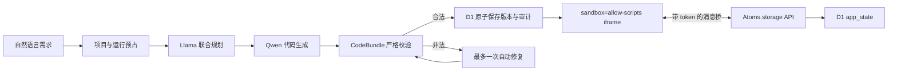

# Atomize — AI App Builder Demo

[在线体验（Cloudflare Workers）](https://atomize-ai-builder-demo.atomize-demo.workers.dev) · [公开源码](https://github.com/bufferstreamer/atoms-demo)

Atomize 是一个可实际使用的智能体应用生成器 Demo。用户用自然语言描述需求，系统完成产品、架构、体验规划，再由 Cloudflare Workers AI 生成 HTML、CSS 和 JavaScript；结果经过服务端安全校验后写入 D1，并在隔离 iframe 中直接运行。

它不是固定模板截图：生成的按钮、表单、筛选、计算和状态变化都能操作，应用可通过受控的 `Atoms.storage` API 保存数据，项目、对话、生成过程和不可变版本也会在刷新后恢复。

## 可以直接测试什么

- 输入计数器、Todo、计算器、报名页、预算工具等不同需求，得到需求对齐的前端应用。
- 查看 Emma（产品）→ Bob（架构）→ Iris（设计）→ Alex（工程）的生成步骤和真实来源。
- 在右侧隔离预览中点击、输入、筛选、提交，并切换桌面/移动视图。
- 在“代码”页查看和复制生成的 `index.html`、`styles.css`、`app.js`。
- 刷新页面后恢复工作区和生成应用通过 `Atoms.storage` 保存的状态。
- 对同一项目继续提出修改，生成新版本并切回任意历史版本。
- 用另一个无共享 Cookie 的浏览器会话验证匿名工作区隔离。

## 模型与降级策略

- 规划：`@cf/meta/llama-3.3-70b-instruct-fp8-fast`，一次结构化调用，同时产出产品、架构和设计计划。
- 工程：`@cf/qwen/qwen2.5-coder-32b-instruct`，生成严格的 CodeBundle；非法产物最多自动修复一次。
- 规划模型失败时使用确定性规划结果继续调用 Qwen，不会直接换成无关演示内容。
- 只有需求明确匹配“增加、减少、重置”的计数器时，AI 全部失败后才允许使用窄范围安全编译器；其他需求会透明失败，不伪装成成功。

线上验收已经取得 Qwen `workers_ai/SUCCESS` 的 Todo 与计数器 CodeBundle，并回查同一 D1 run/version/event/deadline audit 链。

## 架构



- `lib/ai-generator.ts`：联合规划、Qwen builder、修复、模型预算与透明来源。
- `lib/code-bundle.ts`：sentinel 协议、大小/结构/安全校验、计数器编译器和 base64 沙箱引导。
- `lib/store.ts`：D1 schema、owner 隔离、限流、运行租约、版本原子提交、审计和应用状态。
- `app/workspace.tsx`：三栏工作区、生成状态、双 renderer、代码视图、iframe bridge 和版本切换。
- `db/schema.ts`、`drizzle/`：可重复的 D1 数据契约和增量迁移。

## 沙箱与数据边界

生成物只允许三个纯文本文件，不允许外部依赖或任意后端代码。服务端会拒绝外链资源、内联事件、`fetch`/XHR/WebSocket、`eval`、动态 import、Worker、父页面访问、导航、无限循环和 raw-text 逃逸等模式。

预览 iframe 只有 `allow-scripts`，没有 `allow-same-origin`。CSP 默认关闭网络、导航目标、外部字体、对象、子 frame 和表单提交。生成代码不能直接访问 Cookie、父 DOM 或 D1；持久化只能经过带随机 channel token、来源校验、exact envelope、owner/project 授权、容量和频率限制的消息桥。

当前能力边界是“任意安全的纯前端小应用”，不包括 npm 依赖、外部 API、上传、登录、支付、自定义后端、服务端任务或完全抵御恶意 CPU/内存攻击。匿名身份使用 HttpOnly Cookie，适合公开挑战 Demo，不等同于生产账号体系。

## 本地运行

要求 Node.js `>=22.13.0`。

```bash
pnpm install
pnpm dev
```

打开 `http://localhost:3000`。本地没有远程 Workers AI 时，严格计数器仍可由安全编译器生成；其他需求需要部署环境中的 AI binding。

## 验证

```bash
pnpm lint
pnpm exec tsc --noEmit
pnpm test
```

`pnpm test` 会先执行 production build，再运行 CodeBundle、安全边界、模型调用/修复、计数器语义和旧 AppSpec 回归测试。Feature Delivery 与 VibeTest 基线、独立复核及证据位于 `.feature-delivery/` 和 `.vibetest/`。

## 部署

Cloudflare Worker 使用 `wrangler.deploy.jsonc`，绑定 `DB`（D1）与 `AI`（Workers AI）：

```bash
pnpm deploy:cloudflare
```

项目同时保留 `.openai/hosting.json` 的 Sites 交付配置；正式挑战测试请以上方 Cloudflare Workers 地址为准。
